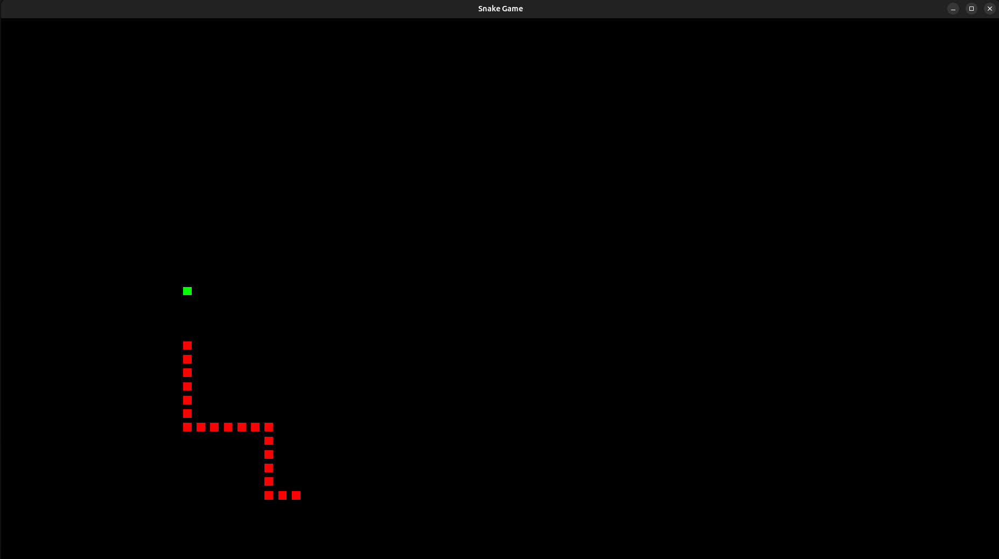

# Snake Game in C using OpenGL

## Overview

This project is a simple Snake Game developed in C using OpenGL and GLUT.  
The player controls the snake, collects apples, and tries to avoid hitting the wall or the snake’s own body.

This project was created as a university programming project to practice C programming, graphics rendering, keyboard input handling, and basic game logic.

## Features

- Snake movement on the screen
- Apple generation at random positions
- Snake growth after eating an apple
- Score counting based on collected food
- Wall collision detection
- Self-collision detection
- Keyboard control using both:
  - `W`, `A`, `S`, `D`
  - Arrow keys
- Simple 2D graphics using OpenGL/GLUT

## Technologies Used

- C Programming Language
- OpenGL
- GLUT / FreeGLUT
- GCC Compiler

## Controls

| Key | Action |
|---|---|
| W | Move Up |
| A | Move Left |
| S | Move Down |
| D | Move Right |
| Arrow Up | Move Up |
| Arrow Left | Move Left |
| Arrow Down | Move Down |
| Arrow Right | Move Right |

## How to Run

### 1. Install required libraries

On Ubuntu/Linux, install OpenGL and GLUT libraries:

```bash
sudo apt update
sudo apt install build-essential freeglut3-dev
```

### 2. Compile the code
```bash
gcc snake_game.c -o snake_game -lGL -lGLU -lglut
```

### 3. Run the game
```bash
./snake_game
```

## Screenshot

### Gameplay

